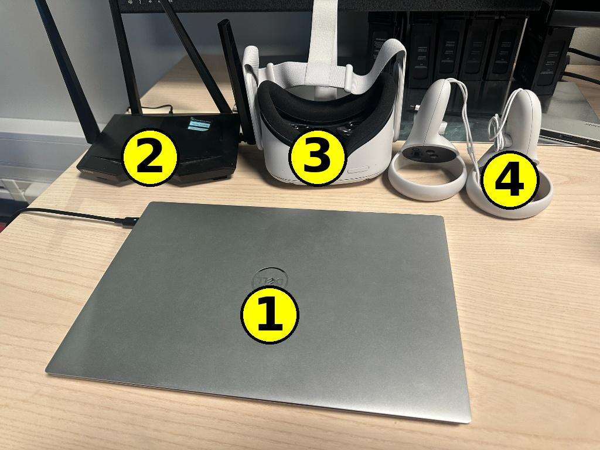
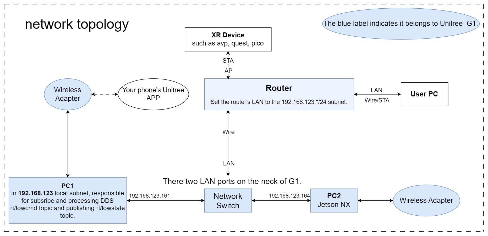

# Teleoperate Unitree G1

A guide to teleoperate the Unitree G1 humanoid robot in RPL Lab.

> **Official repo:** https://github.com/unitreerobotics/xr_teleoperate
> Questions? xujiacheng1016@hotmail.com

---

## Quick Start

Make sure the robot is in motion control mode first — see [Robot Mode Switching](#robot-mode-switching).

```bash
conda activate tv
cd xr_teleoperate/teleop
python teleop_hand_and_arm.py --headless --input-mode controller --record --dex3 --motion
```

Then open the VR browser and navigate to (replace `<host_ip>` with your PC's IP from `ifconfig`):

```
https://<host_ip>:8012/?ws=wss://<host_ip>:8012
```

Accept the security warning, then verify hand/controller tracking in the Settings page.

---

## Hardware Required
<p align="center">

</p>

| # | Item | Note |
|---|------|------|
| 1 | Host Computer | Ubuntu, runs teleop code |
| 2 | WiFi Router | connect robot + VR + PC |
| 3 | VR Headset | Quest or Pico |
| 4 | VR Controller | For mode switching |
<p align="center">

</p>
- Unitree G1 (teleperate in RPL Lab)

---

## Overview

This guide covers teleoperation of the **real G1 robot** via VR headset only.
For simulation, see the [official repo](https://github.com/unitreerobotics/xr_teleoperate.git).

---

## Network Topology



- **STA** = wireless connection
- **LAN** = wired connection (required for G1 ↔ router)

All devices must be on the same subnet (e.g., `192.168.123.x`). Ensure no firewall is blocking traffic.

### Router Setup

Log into your router's admin page and keep all devices on the same subnet.

**Optional — reduce latency:**
- Use Wi-Fi 6 or above
- Increase channel bandwidth
- Manually set channel to 149–165 (disable auto-select)
- Disable 2.4 GHz network
- Verify: `ping <robot_ip>` should be under 2 ms

---

## Startup Sequence (Follow in Order)

1. Power on G1
2. Connect G1 to router via **LAN**
3. Connect host computer to same WiFi (`192.168.123.*`)
4. Connect VR headset to same WiFi
5. SSH into robot to verify connection:
   ```bash
   ssh unitree@192.168.123.164
   ```
6. *(Optional)* Start image server
7. Switch robot to **motion control mode** (see below)
8. Start teleoperation script on host
9. Open VR browser and begin control

---

## Robot Mode Switching

Use the Unitree remote controller to switch modes after powering on:

```
L2 + B        → Damp mode
L2 + ↑        → Ready mode
R2 + A        → Motion control mode  ← required for teleop
```

---

## Safety

To stop the robot immediately:

- **In terminal:** press `q`
- **Via remote controller:** long-press `L2 + B`

---

## Known Issues

- **Environment setup:** pin `numpy==1.26.4`, `params_proto==2.13.2`, `rerun-sdk==0.16.1`
- **Simulation mode:** disable binocular camera in `cam_config_server.yaml`
